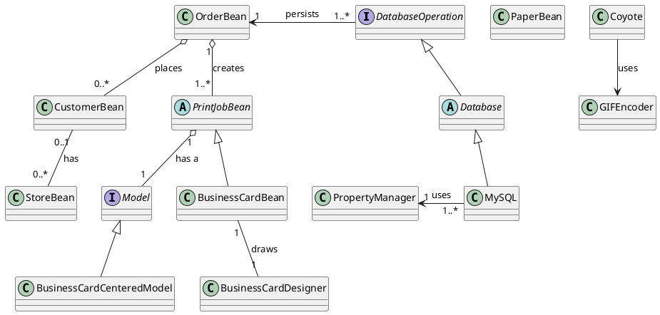

# INTERFACE : 
I have defined the interface in 3 ways.
1. Any service reqirement specification it consider as an interface.
   - Example - JDBC API access requirement specification to delevop database driver database vander is responsible JDBC API.
    ## Implementation Class Diagram

This diagram represents the class relationships for the JdBA API, including MySQL, Oracle Driver, and DBQ Driver.

### UML Diagram

### How to View the Diagram
To visualize this diagram, you can use:
- [PlantUML Online](https://www.plantuml.com/plantuml/uml/)
- Local PlantUML setup with Graphviz
- Integrated PlantUML renderers in IDEs like VS Code or IntelliJ

### Dependencies
- **JdBA API**: Core logic and database operations
- **MySQL, Oracle Driver, DBQ Driver**: Database connections
- **PropertyManager**: Configuration handling

This diagram provides a structured view of how components interact within the system.

